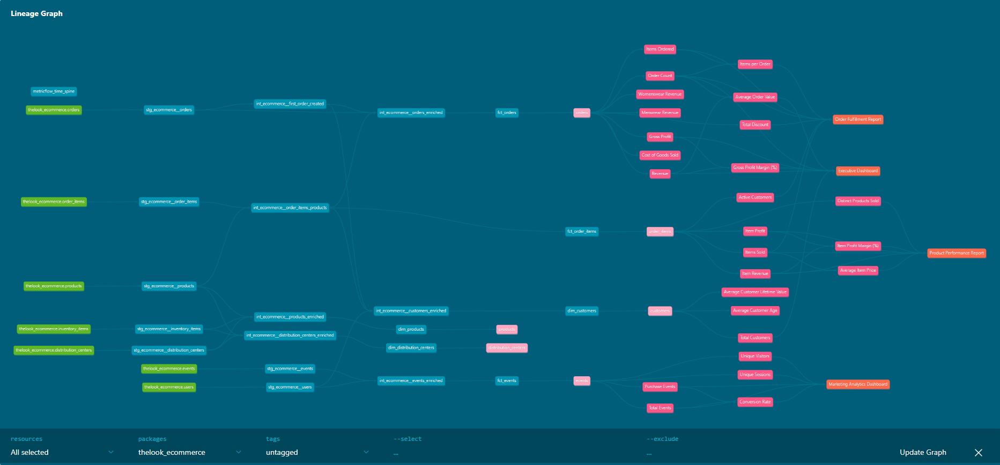

# TheLook eCommerce — dbt Project

Analytics engineering project built on [Google BigQuery](https://cloud.google.com/bigquery) using [dbt](https://www.getdbt.com/), following the **medallion architecture** (staging → intermediate → marts) with a **MetricFlow semantic layer** on top.



## Project Structure

```
models/
├── staging/          # 1:1 source mirrors (views)
│   ├── stg_ecommerce__distribution_centers
│   ├── stg_ecommerce__events
│   ├── stg_ecommerce__inventory_items
│   ├── stg_ecommerce__order_items
│   ├── stg_ecommerce__orders
│   └── stg_ecommerce__products
├── intermediate/     # Business logic joins & enrichment (tables)
│   ├── int_ecommerce__customers_enriched
│   ├── int_ecommerce__distribution_centers_enriched
│   ├── int_ecommerce__events_enriched
│   ├── int_ecommerce__first_order_created
│   ├── int_ecommerce__order_items_products
│   ├── int_ecommerce__orders_enriched
│   └── int_ecommerce__products_enriched
└── marts/            # Business-facing models (tables / incremental)
    ├── _metrics.yml                          # 27 metrics (all domains)
    ├── metricflow_time_spine.sql             # Day-grain time spine
    ├── exposures.yml                         # BI tool dependencies (semantic layer)
    ├── core/
    │   ├── _core__semantic_models.yml        # Semantic models: customers, products, distribution_centers, orders, order_items
    │   ├── dim_customers
    │   ├── dim_distribution_centers
    │   ├── dim_products
    │   ├── fct_orders
    │   └── fct_order_items
    └── marketing/
        ├── _marketing__semantic_models.yml   # Semantic model: events
        └── fct_events
```

## Semantic Layer

All downstream BI tools (dashboards, reports) consume data exclusively through the **dbt Semantic Layer** powered by MetricFlow — not by querying gold mart tables directly. This guarantees a single source of truth for every metric definition.

### Semantic Models

| Semantic Model | Source Model | Domain | Key Entities |
|---|---|---|---|
| `customers` | `dim_customers` | Core | customer (primary) |
| `products` | `dim_products` | Core | product (primary), distribution_center (foreign) |
| `distribution_centers` | `dim_distribution_centers` | Core | distribution_center (primary) |
| `orders` | `fct_orders` | Core | order (primary), customer (foreign) |
| `order_items` | `fct_order_items` | Core | order_item (primary), order / customer / product (foreign) |
| `events` | `fct_events` | Marketing | event (primary), customer (foreign) |

### Metrics (27)

| Domain | Metric | Type |
|---|---|---|
| Revenue & Profitability | `revenue`, `cost_of_goods_sold`, `gross_profit`, `total_discount` | simple |
| | `gross_profit_margin` | derived |
| | `menswear_revenue`, `womenswear_revenue` | simple |
| Order Performance | `order_count`, `items_ordered` | simple |
| | `average_order_value`, `items_per_order` | derived |
| Item-Level Performance | `item_revenue`, `items_sold`, `item_profit` | simple |
| | `average_item_price`, `item_profit_margin` | derived |
| Customer | `total_customers`, `average_customer_age`, `average_customer_ltv`, `active_customers`, `distinct_products_sold` | simple |
| Marketing & Conversion | `total_events`, `purchase_events`, `unique_sessions`, `unique_visitors` | simple |
| | `conversion_rate` | ratio |

### Querying Metrics

```bash
# List all metrics
mf list metrics

# Query a metric
mf query --metrics revenue --group-by metric_time__month

# Query multiple metrics with dimensions
mf query --metrics revenue,order_count --group-by metric_time__month,customer__gender
```

### Time Spine

A day-grain time spine (`metricflow_time_spine`) spanning 2019-01-01 to 2030-01-01 is materialised as a table and required by MetricFlow for time-based metric calculations.

## Prerequisites

- Python 3.12+
- A Google Cloud project with BigQuery enabled
- Authenticated `gcloud` CLI or a service account key

## Setup

1. **Clone the repository**

   ```bash
   git clone https://github.com/dumisanimagagula/dbt_fundamentals_medallion_architecture.git
   cd dbt_fundamentals_medallion_architecture
   ```

2. **Create and activate a virtual environment**

   ```bash
   python -m venv .venv
   source .venv/bin/activate   # Windows: .venv\Scripts\activate
   ```

3. **Install Python dependencies**

   ```bash
   pip install -r requirements.txt
   ```

4. **Configure your dbt profile**

   Create or update `~/.dbt/profiles.yml`:

   ```yaml
   thelook_ecommerce:
     target: dev
     outputs:
       dev:
         type: bigquery
         method: oauth
         project: <your-gcp-project>
         dataset: <your-dataset>
         threads: 4
   ```

5. **Install dbt packages**

   ```bash
   dbt deps
   ```

6. **Verify the setup**

   ```bash
   dbt build         # run models + tests
   ```

## Running

```bash
dbt build         # run models + tests
dbt docs generate # generate documentation
dbt docs serve    # browse at localhost:8080
```

## Testing & Linting

```bash
dbt test                     # run all tests
sqlfluff lint models/        # lint SQL files
pre-commit run --all-files   # run all pre-commit hooks
```

## Packages

| Package | Version | Purpose |
|---|---|---|
| dbt_utils | 1.3.3 | SQL utilities & generic tests |
| dbt_expectations | 0.10.10 | Data quality assertion tests |
